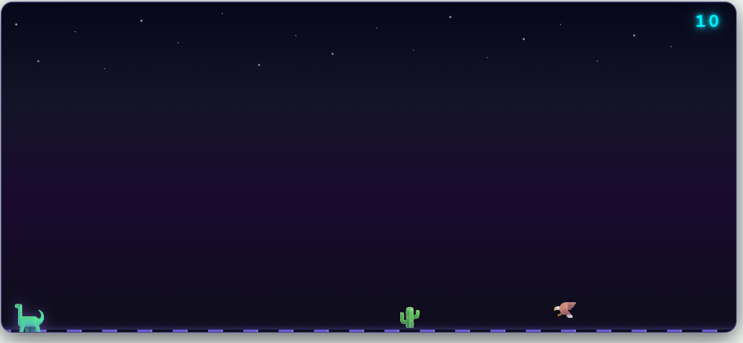
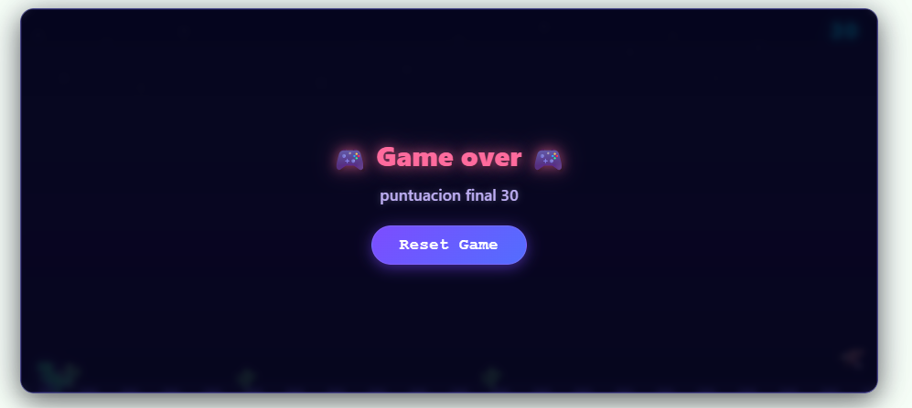

# Dino Run - Cosmic Runner Game

A clone of Chrome's legendary offline dinosaur game, rebuilt from scratch with **React + Vite** and a unique **cosmic/neon space theme**. Jump over cactus obstacles, dodge flying eagles, and survive as long as you can while the speed increases with your score.

<div align="center">


</div>

---

## Gameplay

> **Controls:** Press `Space` or `ArrowUp` to jump. Press `ArrowDown` to duck under flying eagles.

### Video Demo

<video src="docs/assets/gameplay.mp4" controls width="700"></video>

> *If the video does not play, [download it here](docs/assets/gameplay.mp4).*

### Screenshots

<div align="center">
  
  <br/><br/>
  
  <br/><br/>
  
</div>

---

## Features

- **Space/Cosmic Theme** with animated neon ground and starfield background
- **Jump & Duck mechanics** (Space/ArrowUp to jump, ArrowDown to duck)
- **Dynamic difficulty** - speed increases progressively with your score
- **Random enemy spawning** - 70% cactus, 30% flying eagle
- **Collision detection** on both X and Y axes
- **Score tracking** with neon HUD display
- **Game Over screen** with reset functionality

---

## Tech Stack

| Technology | Purpose |
|------------|---------|
| **React 19** | UI rendering and state management |
| **Vite 8** | Build tool and dev server |
| **ESLint** | Code linting |
| **CSS3** | Animations, gradients, and neon effects (no external libraries) |

---

## Project Structure

```
dinosaur-game/
├── docs/
│   └── assets/             # Screenshots & video for README
│       ├── hero.png
│       ├── dinorun.png
│       ├── game-over.png
│       └── gameplay.mp4
├── public/
│   ├── favicon.svg
│   └── icons.svg
├── src/
│   ├── assets/             # App static assets
│   ├── hooks/
│   │   └── useKeyboardControls.js
│   ├── utils/
│   │   └── gameHelper.js   # Collision, velocity, obstacle logic
│   ├── App.jsx             # Main game component
│   ├── App.css             # Cosmic theme styles
│   ├── index.css           # Global styles
│   └── main.jsx            # Entry point
├── .gitignore
├── eslint.config.js
├── index.html
├── package.json
└── vite.config.js
```

---

## Getting Started

### Prerequisites

- [Node.js](https://nodejs.org/) v18 or higher
- npm (comes with Node.js)

### Installation

```bash
# Clone the repository
git clone https://github.com/YOUR_USERNAME/dinosaur-game.git

# Navigate into the project
cd dinosaur-game

# Install dependencies
npm install

# Start the development server
npm run dev
```

The game will be available at `http://localhost:5173`.

### Available Scripts

| Command | Description |
|---------|-------------|
| `npm run dev` | Start development server |
| `npm run build` | Build for production |
| `npm run preview` | Preview production build |
| `npm run lint` | Run ESLint |

---

## How It Works

The game loop runs on `setInterval` at 20ms intervals. Each tick:

1. **Obstacles move left** at a speed calculated by `calculateVelocity()` based on current score
2. **New enemies spawn** at random intervals (60-140 ticks) via `getRandomEnemyType()`
3. **Collision detection** checks X and Y overlap between the dino and every obstacle
4. **Gravity physics** apply when the dino jumps (`velocity -= 0.5` per tick)
5. **Game ends** when collision is detected, stopping the game loop

---

## License

This project is open source and available under the [MIT License](LICENSE).

---

<div align="center">
  Made with React and a lot of emojis
</div>
